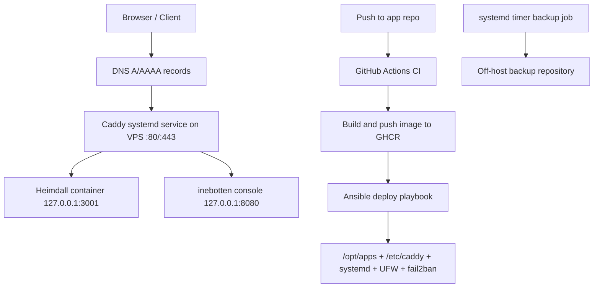
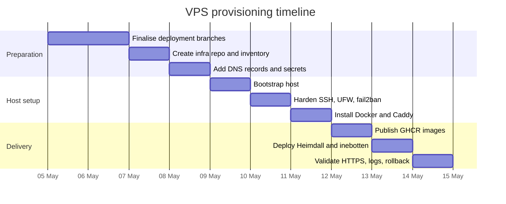

# Production-grade Ansible provisioning for a single VPS hosting Heimdall and inebotten-discord

## Executive summary

The best fit for your situation is a **three-layer design**: app repositories build and publish immutable container images to GHCR after CI passes, a **separate Ansible infrastructure repository** owns the VPS state, and a **host-level Caddy system service** terminates TLS and routes domains to localhost-bound containers. That gives you a clean separation between application delivery and server governance, keeps ports 80/443 owned by one process, and makes auto-renewing HTTPS effectively hands-off through entity["organization","Let's Encrypt","certificate authority"] via Caddy’s automatic HTTPS. fileciteturn20file0L1-L1 fileciteturn31file0L1-L1 citeturn22search1turn22search2turn15search1turn3search1turn3search0

For the OS, I would choose **Ubuntu 24.04 LTS** unless you strongly prefer Debian’s minimalism. Both Ubuntu 24.04 and Debian 12 are supported by Docker’s official packages, but Ubuntu’s current server documentation is especially clear for OpenSSH, UFW, and unattended-upgrades, which makes day-two operations and recovery a bit smoother on a single VPS. Debian 12 remains a sound alternative if you want a slightly leaner base and are comfortable leaning more on upstream and manpage documentation. citeturn7search2turn0search0turn5search1turn5search0turn6search0

Your two repos are **close**, but not yet equally production-ready. Heimdall’s deployment branch already contains the right structural pieces for a shared VPS deployment: `output: "standalone"`, a multi-stage Node image, a localhost-only production compose file, and a GHCR publish workflow. By contrast, the default branch still documents Coolify-style deployment rather than the GHCR plus Ansible path. Inebotten’s deployment branch is directionally right too: it introduces an app-only `compose.production.yml`, adds GHCR publishing, and explicitly demotes the old webhook-based updater to legacy status. The biggest remaining gaps are operational rather than conceptual: pinning third-party GitHub Actions to SHAs, making rollback use immutable image tags by default, hardening the inebotten runtime container, and centralising all VPS state into one Ansible repo. fileciteturn14file0L1-L1 fileciteturn15file0L1-L1 fileciteturn16file0L1-L1 fileciteturn19file0L1-L1 fileciteturn10file0L1-L1 fileciteturn11file0L1-L1 fileciteturn27file0L1-L1 fileciteturn30file0L1-L1 fileciteturn31file0L1-L1 fileciteturn35file0L1-L1 citeturn8search3turn9search3

The security posture should be straightforward and conservative: SSH key-only login, no root SSH login, UFW allowing only 22/80/443, Fail2ban for SSH, unattended security updates, Caddy as a systemd service, Docker app ports bound to `127.0.0.1`, and data backups of `/etc`, `/opt/apps`, `/var/lib/caddy`, and the inebotten persistent data directory to an off-host repository. One important caveat must remain explicit: inebotten is a **Discord selfbot**, and entity["company","Discord","chat platform company"] says automating normal user accounts outside its bot API is forbidden and may lead to account termination. That is a real product and policy risk, not just a theoretical one. citeturn5search0turn7search0turn6search0turn21search0turn21search3 fileciteturn32file0L1-L1

## Repo audit findings

I started with the connected entity["company","GitHub","code hosting company"] repositories and audited the files that matter most for VPS production: Dockerfiles, compose files, workflows, and deployment docs. The high-confidence finding is that **both projects now have promising deployment branches**, but the default branches do not yet reflect the final recommended production pattern in the same way. fileciteturn10file0L1-L1 fileciteturn11file0L1-L1 fileciteturn31file0L1-L1

| Repo | What is already good | What is still weak or missing for production |
|---|---|---|
| **Heimdall** | The deployment branch sets `output: "standalone"` in `next.config.ts`, adds a clean multi-stage `Dockerfile`, publishes a localhost-only `compose.production.yml` on `127.0.0.1:3001`, and adds a dedicated GHCR publish workflow triggered after CI success. fileciteturn14file0L1-L1 fileciteturn15file0L1-L1 fileciteturn16file0L1-L1 fileciteturn19file0L1-L1 | The default branch still refers to Coolify-style deployment and its `next.config.ts` does not include standalone output. I would not treat the repo as fully ready until the deployment-branch changes land on the default branch. I would also add an explicit health endpoint and commit an `.env.example` for operators. fileciteturn10file0L1-L1 fileciteturn11file0L1-L1 fileciteturn7file0L1-L1 |
| **inebotten-discord** | The deployment branch introduces an app-only `compose.production.yml`, keeps public TLS at a central Caddy layer, adds a GHCR publish workflow, and rewrites the deployment docs to prefer GitHub Actions + GHCR + Ansible over the older webhook updater. fileciteturn27file0L1-L1 fileciteturn30file0L1-L1 fileciteturn31file0L1-L1 | The Dockerfile still runs as root by default and has no `USER` or `HEALTHCHECK`. The legacy all-in-one compose with embedded Caddy still exists for backward compatibility, which is useful, but it should not be the production path for a shared VPS. The repo also carries a non-technical risk because it is a selfbot. fileciteturn36file0L1-L1 fileciteturn35file0L1-L1 fileciteturn32file0L1-L1 citeturn21search0 |

Across **both** repos, there is one cross-cutting improvement I strongly recommend before you automate production deploys from CI: **pin third-party actions to commit SHAs rather than only version tags**. GitHub’s own Docker publishing guide explicitly recommends pinning actions for supply-chain safety. Right now both repos use version tags such as `@v3`, `@v4`, `@v5`, and `@v6`, which is normal during development but weaker than a fully pinned production posture. fileciteturn19file0L1-L1 fileciteturn30file0L1-L1 fileciteturn34file0L1-L1 citeturn8search3

A second cross-cutting point is **deployment ownership**. Heimdall’s deployment docs already assume that Caddy is external and managed by a separate infrastructure repository, which is exactly the right mental model for your VPS. Inebotten’s updated deployment docs now move in the same direction. I agree with that philosophy: app repos should own application images and application-local compose fragments; the infrastructure repo should own SSH hardening, Docker installation, Caddy, firewalls, timers, backups, and rendered deployment files on the server. fileciteturn20file0L1-L1 fileciteturn31file0L1-L1 citeturn2search1turn2search2

## Recommended target architecture

The target state should be a **single VPS with one public reverse proxy and two private app projects**. Caddy runs as a native systemd service on the host and owns ports 80 and 443. Each app is deployed with Docker Compose as its own project under `/opt/apps/<app-name>`, binds only to `127.0.0.1`, and is therefore unreachable directly from the public network. This design aligns with Caddy’s recommended service-based operation, with automatic HTTPS and persistent certificate storage, and it avoids the well-documented Docker/UFW footgun where container-published ports can bypass host firewall expectations unless you bind carefully and/or use the `DOCKER-USER` chain. citeturn15search1turn22search0turn22search1turn22search2turn7search0turn7search3



My recommended host layout is:

- `/opt/apps/heimdall/`
- `/opt/apps/inebotten-discord/`
- `/etc/caddy/Caddyfile`
- `/etc/ssh/sshd_config.d/99-hardening.conf`
- `/etc/fail2ban/jail.d/sshd.local`
- `/etc/apt/apt.conf.d/20auto-upgrades`
- `/etc/apt/apt.conf.d/50unattended-upgrades`
- `/var/lib/caddy/` for certificates and Caddy state
- `/opt/backups/` only if you stage local archives before off-host upload

That keeps persistent web-server state in the place Caddy expects, while app state remains app-local and therefore easier to back up and restore. Official Caddy packages for Debian and Ubuntu run Caddy as a systemd service and use `/var/lib/caddy` for state; Docker’s docs recommend installing Docker from the official apt repository and note that Docker Compose v2 is the modern plugin path. citeturn15search0turn15search1turn22search0turn7search2turn0search0turn0search2

For domains, the principle is simple: one site block per public hostname, one reverse proxy target per app. Caddy automatically obtains and renews certificates when it has a valid hostname, and it uses HTTP port 80 both for redirects and for ACME HTTP-01 in common cases. As a result, you should **leave 80 open** as well as 443; closing 80 is not a recommended hardening step for public web services. citeturn22search1turn22search2turn13search1turn13search0

## Recommended Ansible repository design

A dedicated infrastructure repository should follow Ansible’s role-first, environment-specific layout rather than mixing application code and host state. That matches Ansible’s long-standing best-practice guidance around inventories, `group_vars`, `host_vars`, roles, and top-level playbooks. citeturn2search1turn2search2

```text
vps-infra/
├── ansible.cfg
├── collections/
│   └── requirements.yml
├── inventories/
│   └── production/
│       ├── hosts.yml
│       ├── group_vars/
│       │   ├── all.yml
│       │   ├── apps.yml
│       │   ├── caddy.yml
│       │   ├── security.yml
│       │   └── vault.yml
│       └── host_vars/
│           └── vps01.yml
├── playbooks/
│   ├── bootstrap.yml
│   ├── hardening.yml
│   ├── caddy.yml
│   ├── deploy-apps.yml
│   ├── backup.yml
│   └── site.yml
├── roles/
│   ├── base/
│   ├── sshd_hardening/
│   ├── ufw/
│   ├── fail2ban/
│   ├── unattended_upgrades/
│   ├── docker_engine/
│   ├── caddy/
│   ├── app_compose/
│   └── backup_restic/
└── templates/
    ├── Caddyfile.j2
    ├── docker-compose.j2
    ├── sshd-hardening.conf.j2
    ├── fail2ban-sshd.local.j2
    ├── backup.service.j2
    └── backup.timer.j2
```

The collections file should be explicit, because the modules you want for this design are **not all in `ansible-core`**. In particular, `community.docker.docker_compose_v2`, `community.docker.docker_login`, and `community.general.ufw` live in external collections. citeturn3search1turn3search0turn3search2

```yaml
# collections/requirements.yml
collections:
  - name: community.docker
  - name: community.general
```

A minimal production inventory can stay very small:

```yaml
# inventories/production/hosts.yml
all:
  children:
    vps:
      hosts:
        vps01:
          ansible_host: 203.0.113.10
          ansible_user: deploy
          ansible_port: 22
```

```yaml
# inventories/production/group_vars/all.yml
timezone: Europe/Oslo
caddy_email: ops@example.com
docker_users:
  - deploy

apps:
  - name: heimdall
    domain: heimdall.example.com
    project_src: /opt/apps/heimdall
    image: ghcr.io/reedtrullz/heimdall
    image_tag: sha-abcdef1
    upstream_host: 127.0.0.1
    upstream_port: 3001
    container_port: 3000
    env:
      NODE_ENV: production

  - name: inebotten-discord
    domain: bot.example.com
    project_src: /opt/apps/inebotten-discord
    image: ghcr.io/reedtrullz/inebotten-discord
    image_tag: sha-1234567890abcdef
    upstream_host: 127.0.0.1
    upstream_port: 8080
    container_port: 8080
    volumes:
      - ./data:/root/.hermes
```

Secrets should not live in plain YAML. Use **Ansible Vault**, preferably with a dedicated production vault ID, and remember the subtle but important limitation from the docs: Vault protects **data at rest**, not secrets once they are in use during task execution. In practice that means using Vault for stored secrets **and** `no_log: true` on tasks that render `.env` files, registry credentials, or API keys. citeturn1search1turn1search7turn20search4turn20search5

```yaml
# inventories/production/group_vars/vault.yml
vault_ghcr_username: your-gh-user
vault_ghcr_token: ghp_xxx
vault_console_api_key: super-secret
vault_discord_user_token: super-secret
vault_openrouter_api_key: super-secret
vault_tavily_api_key: super-secret
vault_browserbase_api_key: super-secret
vault_browserbase_project_id: super-secret
```

A good operating pattern is:

- `--vault-id prod@prompt` for ad hoc runs on your laptop
- a password script or secret manager for CI-based Ansible runs
- one vault file per environment, not per role
- only secrets in Vault, not all variables

That keeps diffs readable and aligns with Ansible’s documented support for multiple vault IDs and encrypted files under version control. citeturn20search4turn20search2

## Idempotent playbooks and templates

The safest implementation style is to keep tasks declarative and lean on modules with documented idempotence. `ansible.builtin.template` supports atomic file operations and `validate`, `ansible.builtin.apt` manages packages natively on Debian and Ubuntu, `community.docker.docker_login` is idempotent, and `community.docker.docker_compose_v2` is the right module for Compose v2-based lifecycle management. citeturn2search0turn2search4turn4search8turn3search0turn3search1

A bootstrap playbook should do only the first-host essentials: apt basics, the deploy user, SSH keys, Docker, and Caddy.

```yaml
# playbooks/bootstrap.yml
- name: Bootstrap VPS
  hosts: vps
  become: true
  tasks:
    - name: Install base packages
      ansible.builtin.apt:
        name:
          - curl
          - git
          - ca-certificates
          - gnupg
          - ufw
          - fail2ban
          - unattended-upgrades
        state: present
        update_cache: true

    - name: Ensure deploy user exists
      ansible.builtin.user:
        name: deploy
        groups: sudo
        append: true
        shell: /bin/bash
        create_home: true

    - name: Install operator SSH key
      ansible.builtin.copy:
        dest: /home/deploy/.ssh/authorized_keys
        content: "{{ lookup('file', '~/.ssh/id_ed25519.pub') }}\n"
        owner: deploy
        group: deploy
        mode: "0600"
```

The SSH hardening role should render a dedicated snippet under `sshd_config.d`, then validate it **before** reload. The Ansible `template` docs use exactly this validation pattern for `sshd`. Ubuntu’s OpenSSH docs recommend snippet-based configuration and checking with `sshd -t` before restart. citeturn2search4turn16search1turn17view0turn18view1turn18view2turn18view3turn18view4

```yaml
# playbooks/hardening.yml
- name: SSH and host hardening
  hosts: vps
  become: true
  tasks:
    - name: Render sshd hardening snippet
      ansible.builtin.template:
        src: sshd-hardening.conf.j2
        dest: /etc/ssh/sshd_config.d/99-hardening.conf
        owner: root
        group: root
        mode: "0644"
        validate: /usr/sbin/sshd -t -f %s
      notify: Reload ssh

    - name: Enable UFW default deny incoming
      community.general.ufw:
        state: enabled
        direction: incoming
        policy: deny

    - name: Allow SSH, HTTP, HTTPS
      community.general.ufw:
        rule: allow
        port: "{{ item }}"
        proto: tcp
      loop:
        - "22"
        - "80"
        - "443"

    - name: Configure fail2ban for sshd
      ansible.builtin.template:
        src: fail2ban-sshd.local.j2
        dest: /etc/fail2ban/jail.d/sshd.local
        owner: root
        group: root
        mode: "0644"
      notify: Restart fail2ban

  handlers:
    - name: Reload ssh
      ansible.builtin.service:
        name: ssh
        state: reloaded

    - name: Restart fail2ban
      ansible.builtin.service:
        name: fail2ban
        state: restarted
```

A sound SSH snippet for this VPS looks like:

```conf
# templates/sshd-hardening.conf.j2
PermitRootLogin no
PubkeyAuthentication yes
PasswordAuthentication no
KbdInteractiveAuthentication no
MaxAuthTries 3
X11Forwarding no
AllowTcpForwarding no
AllowAgentForwarding no
ClientAliveInterval 300
ClientAliveCountMax 2
```

For application deployment, the core task pattern is: authenticate to GHCR if needed, render environment and compose files, then run Compose v2 in place. For **public** GHCR images, the VPS can pull anonymously; for private images or future-proofing, log in with a PAT classic that has `read:packages`. In GitHub Actions, use `GITHUB_TOKEN` for publishing. citeturn8search5turn8search3turn3search0

```yaml
# playbooks/deploy-apps.yml
- name: Deploy app projects
  hosts: vps
  become: true
  tasks:
    - name: Log into GHCR when credentials are supplied
      community.docker.docker_login:
        registry_url: ghcr.io
        username: "{{ vault_ghcr_username }}"
        password: "{{ vault_ghcr_token }}"
      when: vault_ghcr_username is defined and vault_ghcr_token is defined
      no_log: true

    - name: Ensure project directories exist
      ansible.builtin.file:
        path: "{{ item.project_src }}"
        state: directory
        owner: deploy
        group: deploy
        mode: "0755"
      loop: "{{ apps }}"

    - name: Render compose file
      ansible.builtin.template:
        src: docker-compose.j2
        dest: "{{ item.project_src }}/compose.production.yml"
        owner: deploy
        group: deploy
        mode: "0644"
      loop: "{{ apps }}"

    - name: Render env file
      ansible.builtin.template:
        src: "{{ item.name }}.env.j2"
        dest: "{{ item.project_src }}/.env"
        owner: deploy
        group: deploy
        mode: "0600"
      loop: "{{ apps }}"
      no_log: true

    - name: Pull and reconcile containers
      community.docker.docker_compose_v2:
        project_src: "{{ item.project_src }}"
        files:
          - compose.production.yml
        pull: always
        remove_orphans: true
        state: present
      loop: "{{ apps }}"
```

The generic compose template should enforce **localhost-only publishing**:

```yaml
# templates/docker-compose.j2
services:
  {{ item.name }}:
    image: {{ item.image }}:{{ item.image_tag }}
    restart: unless-stopped
    env_file:
      - .env

    volumes:

      - {{ volume }}


    ports:
      - "127.0.0.1:{{ item.upstream_port }}:{{ item.container_port }}"
    logging:
      driver: json-file
      options:
        max-size: "10m"
        max-file: "3"
```

The Caddy role should render the whole host config from inventory data and reload, not restart, on change. Host-based Caddy is preferable here because its package and service model are first-class on Debian/Ubuntu and its state lives in a predictable system location. citeturn15search0turn15search1turn22search0turn14search1

```caddyfile
# templates/Caddyfile.j2
{
    email {{ caddy_email }}
}


{{ app.domain }} {
    reverse_proxy {{ app.upstream_host }}:{{ app.upstream_port }}
    header {
        X-Frame-Options "DENY"
        X-Content-Type-Options "nosniff"
        Referrer-Policy "strict-origin-when-cross-origin"
    }
}

```

For app-specific example files, I would keep Heimdall’s branch changes, but tighten the image slightly:

```dockerfile
# Heimdall Dockerfile
FROM node:22-alpine AS deps
WORKDIR /app
COPY package.json package-lock.json ./
RUN npm ci

FROM node:22-alpine AS build
WORKDIR /app
COPY --from=deps /app/node_modules ./node_modules
COPY . .
RUN npm run build

FROM node:22-alpine AS run
WORKDIR /app
ENV NODE_ENV=production
ENV PORT=3000
COPY --from=build /app/.next/standalone ./
COPY --from=build /app/.next/static ./.next/static
COPY --from=build /app/public ./public
EXPOSE 3000
CMD ["node", "server.js"]
```

```ts
// Heimdall next.config.ts
import type { NextConfig } from "next";

const nextConfig: NextConfig = {
  output: "standalone",
  turbopack: {
    root: __dirname,
  },
};

export default nextConfig;
```

That design matches the deployment branch and is the correct Next.js pattern for containerised standalone deployment. fileciteturn14file0L1-L1 fileciteturn15file0L1-L1

For inebotten, I would keep the existing runtime model but harden the image by creating a non-root user and adding a health check if the console exposes a stable route. The current file does neither, so treat that as an improvement item before you expose the console publicly. fileciteturn36file0L1-L1

## Security, backups, and ACME operations

The SSH baseline should be conservative. Ubuntu’s OpenSSH docs support using snippet files in `/etc/ssh/sshd_config.d/` and validating config before reload. The OpenSSH manual makes the implications of the core directives clear: `PubkeyAuthentication` is enabled by default, `PasswordAuthentication` is allowed by default unless you turn it off, keyboard-interactive auth is enabled by default unless you turn it off, and `PermitRootLogin` defaults to `prohibit-password` rather than fully disabled. For a public VPS, that means you should explicitly harden the defaults instead of assuming them. citeturn16search1turn18view1turn18view2turn18view3turn18view0turn18view4

UFW and Docker deserve special attention together. Ubuntu documents UFW as the default host firewall frontend, but Docker documents that published container ports bypass UFW’s normal filtering path when Docker manipulates NAT rules. The practical answer on a single-app host is often “bind everything sensitive to localhost and open only what the reverse proxy needs.” On your host, that means only `22/tcp`, `80/tcp`, and `443/tcp` should be allowed publicly, and both Heimdall and inebotten should publish only to `127.0.0.1`. If you later need more advanced filtering, enforce it in the `DOCKER-USER` chain rather than assuming UFW alone sees container traffic. citeturn5search0turn7search0turn7search3turn3search2

Fail2ban is still worthwhile for SSH, especially on a public VPS. Debian’s fail2ban manpages recommend keeping package-provided `.conf` files untouched and applying local customisation in `.local` files, and they explicitly support a `systemd` backend that reads the journal instead of log files. That is the right fit on modern Ubuntu/Debian systems running OpenSSH under systemd. citeturn11search2turn11search1

Automatic updates should stay enabled for security patches, but you should make their behaviour explicit. Ubuntu documents that unattended-upgrades is installed by default, that it is controlled mainly by `/etc/apt/apt.conf.d/20auto-upgrades` and `50unattended-upgrades`, that it runs daily by default, and that you can allow only security pockets, blacklist particular packages, or control reboot behaviour. For a single VPS with public services, my recommendation is: keep security updates on, do **not** enable automatic reboot by default, and review whether Docker/Caddy package updates belong in your unattended set or your planned maintenance workflow. citeturn6search0

For Caddy and ACME, the operational rules are simple and important. Caddy automatically obtains and renews certificates when you give it valid hostnames; it redirects HTTP to HTTPS; it needs public DNS pointed at the server; and the usual public-web path expects ports 80 and 443 reachable from the internet. Caddy’s package/service model stores certificates and related state under `/var/lib/caddy`, so that directory must be persistent and included in backups. citeturn22search1turn22search2turn13search1turn22search0

For backups, I recommend an **off-host**, scheduled backup of:

- `/etc/`
- `/opt/apps/heimdall/`
- `/opt/apps/inebotten-discord/.env`
- `/opt/apps/inebotten-discord/data/`
- `/var/lib/caddy/`

Restic is a good fit here because it is snapshot-based, designed to run from a scheduler such as systemd, and supports retention workflows via `forget --prune`. The crucial operational point from the docs is that pruning can take time and locks the repository, so schedule it deliberately rather than on every short-interval run. citeturn19search8turn19search4turn12search2

A simple backup timer model looks like this:

```yaml
# playbooks/backup.yml
- name: Configure backups
  hosts: vps
  become: true
  tasks:
    - name: Install restic
      ansible.builtin.apt:
        name: restic
        state: present
        update_cache: true

    - name: Render backup service
      ansible.builtin.template:
        src: backup.service.j2
        dest: /etc/systemd/system/vps-backup.service
        owner: root
        group: root
        mode: "0644"

    - name: Render backup timer
      ansible.builtin.template:
        src: backup.timer.j2
        dest: /etc/systemd/system/vps-backup.timer
        owner: root
        group: root
        mode: "0644"

    - name: Enable backup timer
      ansible.builtin.service:
        name: vps-backup.timer
        enabled: true
        state: started
```

## CI/CD, testing, rollback, and SSH runbook

The CI/CD pattern I recommend is:

- **App repos** run tests and build images.
- On CI success, they publish **immutable SHA tags** and optionally `latest`.
- A **deployment workflow** then calls the infra repo or runs the infra playbook over SSH, passing the exact image tag to deploy.
- Production deploy jobs use **GitHub environments** for approvals or branch restrictions where appropriate.

This uses GitHub Actions in the way GitHub documents: `workflow_run` can trigger the publish step after CI, environments can gate access to secrets and approvals, and Docker image publishing to GHCR can use `github.actor` plus `GITHUB_TOKEN` inside Actions. citeturn9search3turn8search2turn8search1turn8search6turn8search3

For production deployment, prefer **SHA tags over `latest`**. Both repos’ publish workflows already emit SHA-based tags, which makes rollback precise and auditable. The right operator behaviour is then: update `image_tag` in inventory, run the app deploy playbook, verify, and only then consider advancing `latest` or leaving it as a convenience alias. fileciteturn19file0L1-L1 fileciteturn30file0L1-L1

Before every deploy, test at three layers:

- **Ansible**: `ansible-playbook --check --diff`
- **Caddy**: validate config before reload and inspect `journalctl -u caddy`
- **Containers**: `docker compose ps`, logs, and app health checks

Rollback should be equally boring: set the prior image SHA in inventory and rerun the same deploy playbook. Because `community.docker.docker_compose_v2` reconciles the project state and because Compose files are rendered from inventory, rollback becomes a variable change rather than a shell script adventure. citeturn3search1turn15search1turn12search0turn12search2

A practical first-time runbook over SSH is:

```bash
# On your workstation
python3 -m venv .venv
source .venv/bin/activate
pip install ansible

ansible-galaxy collection install -r collections/requirements.yml

# Create and edit inventory + vaulted secrets
ansible-vault edit inventories/production/group_vars/vault.yml

# First connectivity check
ansible -i inventories/production/hosts.yml vps -m ping --ask-become-pass

# Bootstrap the host
ansible-playbook -i inventories/production/hosts.yml playbooks/bootstrap.yml --ask-become-pass --vault-id prod@prompt

# Keep a second SSH session open, then harden SSH
ansible-playbook -i inventories/production/hosts.yml playbooks/hardening.yml --ask-become-pass --vault-id prod@prompt

# Install Docker and Caddy
ansible-playbook -i inventories/production/hosts.yml playbooks/site.yml --tags "docker,caddy" --ask-become-pass --vault-id prod@prompt

# Deploy applications by immutable image tags
ansible-playbook -i inventories/production/hosts.yml playbooks/deploy-apps.yml --ask-become-pass --vault-id prod@prompt

# Configure backups
ansible-playbook -i inventories/production/hosts.yml playbooks/backup.yml --ask-become-pass --vault-id prod@prompt
```

The **manual DNS checklist** before first public cutover is short:

- Create an `A` record for the Heimdall hostname to the VPS IPv4.
- Create an `A` record for the inebotten console hostname to the VPS IPv4.
- If you use IPv6, create matching `AAAA` records.
- Wait for propagation and verify authoritative resolution.
- Only then reload Caddy for first public certificate issuance. citeturn22search2turn13search1

The **secrets checklist** should include:

- SSH private key used by the Ansible operator or deploy workflow
- Ansible Vault password source
- Optional GHCR PAT classic with `read:packages` for VPS pull auth
- Caddy ACME contact email
- Heimdall environment values if you want non-default THORChain endpoints
- inebotten `DISCORD_USER_TOKEN` or equivalent credentials
- inebotten `CONSOLE_API_KEY`
- `OPENROUTER_API_KEY`
- `TAVILY_API_KEY`
- `BROWSERBASE_API_KEY`
- `BROWSERBASE_PROJECT_ID`
- any Google Calendar credentials or related app secrets fileciteturn11file0L1-L1 fileciteturn37file0L1-L1 citeturn8search5turn7search4

A realistic provisioning and cutover timeline for a single VPS looks like this:



## Risks, limitations, and source notes

The most important non-technical risk is inebotten’s product model. Discord’s own policy states that automating ordinary user accounts as selfbots is forbidden and may result in termination, and the repository’s own security documentation repeats that warning. If this service is business-critical or identity-critical, the production-grade recommendation is to migrate the automation to an official bot-account architecture rather than rely indefinitely on a selfbot. citeturn21search0turn21search3 fileciteturn32file0L1-L1

A smaller but still real operational risk is workflow trust. Because both repos currently use third-party GitHub Actions by version tag rather than pinned SHAs, you inherit some supply-chain trust at deploy time. That is easy to fix and should be fixed before production automation is enabled. fileciteturn19file0L1-L1 fileciteturn30file0L1-L1 citeturn8search3

There are also a few limitations to this audit. I reviewed the connected repositories and the specific files relevant to VPS deployment, but I did **not** inspect a separate infrastructure repo because none was connected in this request. I also did not verify a dedicated health endpoint implementation for either app from the audited deployment files, so I am recommending explicit health checks as a production improvement rather than asserting that they already exist. The conclusions above are therefore highest-confidence on topology, CI/CD, security controls, and deploy mechanics, and somewhat less final on app-specific runtime observability. fileciteturn20file0L1-L1 fileciteturn31file0L1-L1

The main sources used for this report were the two audited repositories and primary documentation for Docker, Caddy, Ansible, GitHub Actions, Ubuntu Server, Debian manpages, systemd, restic, and Discord policy. The most load-bearing references were the Heimdall and inebotten deployment files, Docker’s install and firewall docs, Caddy’s automatic HTTPS and service docs, Ansible’s best-practice and module docs, Ubuntu’s OpenSSH/UFW/unattended-upgrades docs, Debian’s fail2ban manpages, GitHub’s GHCR and environments docs, and Discord’s selfbot policy. fileciteturn14file0L1-L1 fileciteturn15file0L1-L1 fileciteturn16file0L1-L1 fileciteturn19file0L1-L1 fileciteturn27file0L1-L1 fileciteturn30file0L1-L1 fileciteturn31file0L1-L1 citeturn7search2turn0search0turn0search2turn7search0turn15search0turn15search1turn22search1turn22search2turn1search1turn2search1turn3search1turn3search0turn3search2turn5search1turn5search0turn6search0turn11search2turn12search2turn8search3turn8search5turn9search3turn21search0